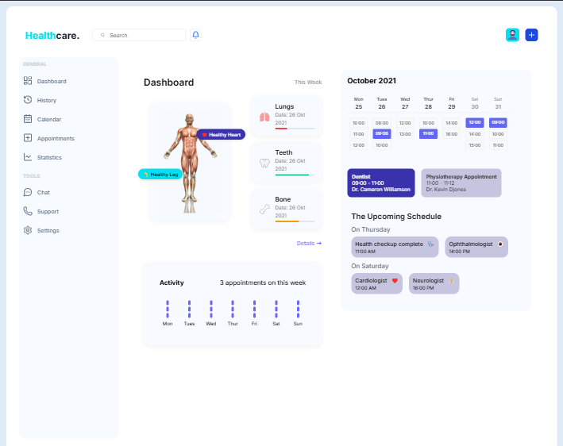

# 🏥 Healthcare Dashboard

A sleek and responsive **Healthcare Dashboard** built using **React** and **CSS Modules**.  
This project focuses on clean component architecture, scoped styling, and a pixel-perfect UI replication of the original design.

---

## 📌 Assignment Preview

> Provided UI design for implementation:

---

## ✅ Live Submission

> Dashboard with responsive design, modular CSS styling. 

---

## 🚀 Live Demo & Code

- 🔗 **Live Preview**: [healthcare-dashborad.netlify.app](https://healthcare-dashborad.netlify.app/)
- 📂 **Source Code**: [GitHub Repository](https://github.com/arinmandal/healthcare-dashboard)

---

## 🛠️ Tech Stack

- **React.js** – Component-based architecture
- **CSS Modules** – Locally scoped, maintainable styles
- **Responsive Layout** – Optimized for desktop and mobile views
- **Lucide Icons** – For clean, scalable vector icons

## 👨‍💻 Developed By
**Arin Mandal**  
Frontend Developer 
🔗 [GitHub](https://github.com/arinmandal)

---
